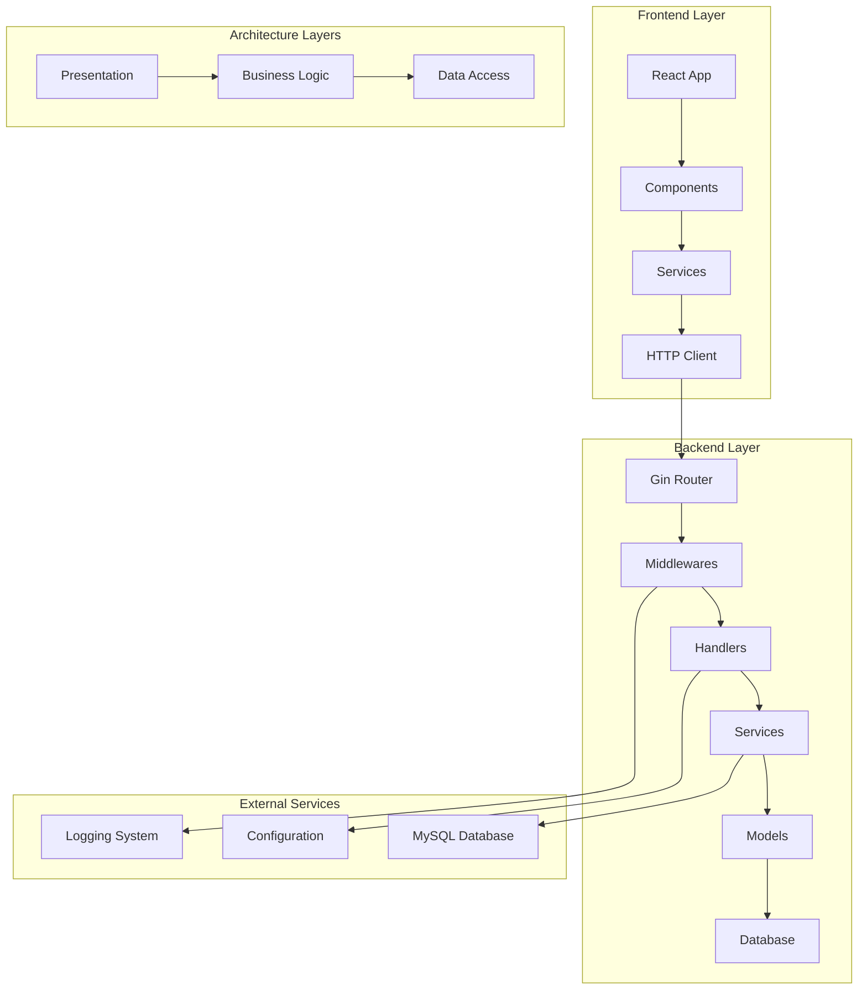
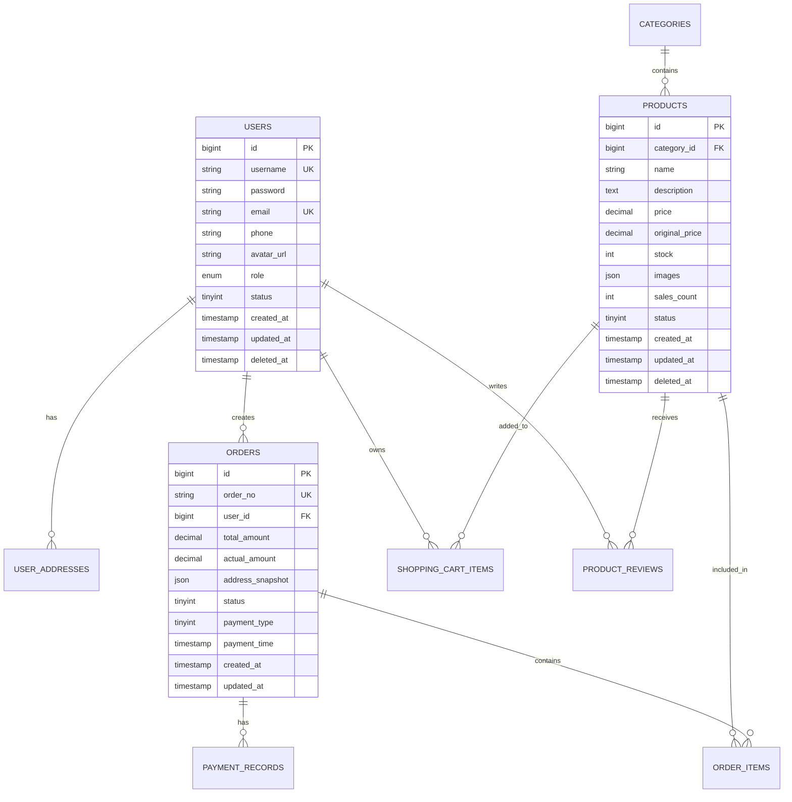

<div align="center"><a name="readme-top"></a>

[](#)

# 🛍️ TikTok Shop Go Template<br/><h3>A Production-Ready E-commerce Backend Template</h3>

A comprehensive full-stack e-commerce template built with Go and React, designed specifically as a learning resource for modern web development.<br/>
Features clean architecture, RESTful APIs, JWT authentication, and complete e-commerce functionality.<br/>
One-click **FREE** deployment of your e-commerce backend.

**Language**: [🇺🇸 English](README.md) · [🇨🇳 中文](README.zh-CN.md)

[Live Demo][demo-link] · [Documentation][docs] · [API Reference][api-docs] · [Issues][github-issues-link]

<br/>

[][demo-link]

<br/>

<!-- SHIELD GROUP -->

[![][github-release-shield]][github-release-link]
[![][go-version-shield]][go-version-link]
[![][license-shield]][license-link]<br/>
[![][github-contributors-shield]][github-contributors-link]
[![][github-forks-shield]][github-forks-link]
[![][github-stars-shield]][github-stars-link]
[![][github-issues-shield]][github-issues-link]<br>

**Share This Repository**

[![][share-x-shield]][share-x-link]
[![][share-linkedin-shield]][share-linkedin-link]
[![][share-reddit-shield]][share-reddit-link]
[![][share-telegram-shield]][share-telegram-link]

<sup>🌟 Building the future of e-commerce development education. Designed for Go learners and professionals.</sup>

[![][github-trending-shield]][github-trending-url]

## 📸 Project Screenshots

> [!TIP]
> Experience the complete e-commerce workflow from authentication to order management.

<div align="center">
  
  <p><em>Modern Authentication Interface - Secure JWT-based login system</em></p>
</div>

<div align="center">
  
  
  <p><em>User Registration and API Management Dashboard</em></p>
</div>

<details>
<summary><kbd>📱 More Screenshots</kbd></summary>

<div align="center">
  
  <p><em>Complete E-commerce Database Design</em></p>
</div>

<div align="center">
  
  <p><em>Interactive API Documentation</em></p>
</div>

</details>

## 🎬 Demo Video

> [!NOTE]
> Watch the complete development and deployment walkthrough.

<div align="center">

[](https://www.youtube.com/watch?v=dQw4w9WgXcQ)

*Click the image above to watch the full demo video*

</div>

**Tech Stack Badges:**

<div align="center">

 
 
 
 
 
 
 

</div>

</div>

> [!IMPORTANT]
> This project demonstrates modern full-stack development practices with Go backend and React frontend. It combines industry-standard patterns with educational clarity to provide a complete e-commerce solution. Features include user authentication, product management, shopping cart, order processing, and payment integration.

<details>
<summary><kbd>📑 Table of Contents</kbd></summary>

#### TOC

- [🛍️ TikTok Shop Go Template](#️-tiktok-shop-go-template)
      - [TOC](#toc)
      - [](#)
  - [🌟 Introduction](#-introduction)
  - [✨ Key Features](#-key-features)
    - [`1` Authentication System](#1-authentication-system)
    - [`2` E-commerce Core](#2-e-commerce-core)
    - [`*` Additional Features](#-additional-features)
  - [🛠️ Tech Stack](#️-tech-stack)
  - [🏗️ Architecture](#️-architecture)
    - [System Architecture](#system-architecture)
    - [Database Design](#database-design)
    - [API Structure](#api-structure)
  - [⚡️ Performance](#️-performance)
  - [🚀 Getting Started](#-getting-started)
    - [Prerequisites](#prerequisites)
    - [Quick Installation](#quick-installation)
    - [Environment Setup](#environment-setup)
    - [Development Mode](#development-mode)
  - [🛳 Deployment](#-deployment)
    - [`A` Local Deployment](#a-local-deployment)
    - [`B` Docker Deployment](#b-docker-deployment)
    - [`C` Cloud Deployment](#c-cloud-deployment)
  - [📖 Usage Guide](#-usage-guide)
    - [API Endpoints](#api-endpoints)
    - [Frontend Usage](#frontend-usage)
    - [Database Operations](#database-operations)
  - [🔌 Integrations](#-integrations)
  - [📦 Frontend Implementations](#-frontend-implementations)
  - [⌨️ Development](#️-development)
    - [Local Development](#local-development)
    - [Adding Features](#adding-features)
    - [Testing](#testing)
  - [🤝 Contributing](#-contributing)
    - [Development Process](#development-process)
    - [Contribution Guidelines](#contribution-guidelines)
  - [❤️ Sponsor](#️-sponsor)
  - [📄 License](#-license)
  - [👥 Team](#-team)

####

<br/>

</details>

## 🌟 Introduction

We are passionate developers creating next-generation e-commerce solutions with Go. By adopting modern development practices and clean architecture principles, we aim to provide developers with powerful, scalable, and educational tools for building production-ready applications.

Whether you're a Go beginner or experienced developer, this template will be your comprehensive learning playground. The project demonstrates industry best practices while maintaining educational clarity for learning purposes.

> [!NOTE]
> - Go >= 1.16 required
> - MySQL >= 8.0 required for data storage
> - Node.js >= 18.0 required for frontend development
> - Redis >= 6.0 recommended for session management

| [![][demo-shield-badge]][demo-link]   | No installation required! Visit our demo to experience it firsthand.                           |
| :------------------------------------ | :--------------------------------------------------------------------------------------------- |
| [![][docs-shield-badge]][docs] | Complete documentation with tutorials and examples. |

> [!TIP]
> **⭐ Star us** to receive all release notifications from GitHub without delay!

[![][image-star]][github-stars-link]

<details>
  <summary><kbd>⭐ Star History</kbd></summary>
  <picture>
    <source media="(prefers-color-scheme: dark)" srcset="https://api.star-history.com/svg?repos=ChanMeng666%2Fdouyin-mall-go-template&theme=dark&type=Date">
    
  </picture>
</details>

## ✨ Key Features

[![][image-feat-core]][docs-feat-core]

### `1` [Authentication System][docs-feat-auth]

Experience enterprise-grade authentication with JWT tokens. Our secure implementation provides robust user management with role-based access control and session handling.

<div align="center">
  
  <p><em>JWT Authentication System with Role-based Access</em></p>
</div>

Key capabilities include:
- 🔐 **JWT Token Management**: Secure token generation and validation
- 👥 **User Registration**: Complete user onboarding with validation
- 🔑 **Secure Login**: Password hashing with bcrypt
- 🛡️ **Middleware Protection**: Route-level authentication
- 📱 **Session Management**: Token refresh and expiration handling

> [!TIP]
> The authentication system follows OAuth 2.0 principles and can be easily extended for social login integration.

[![][back-to-top]](#readme-top)

### `2` [E-commerce Core][docs-feat-ecommerce]

Complete e-commerce functionality that transforms how users shop online. With our comprehensive product catalog, shopping cart, and order management system, users can experience a full shopping journey.

<div align="center">
  
  
  <p><em>Product Catalog and Shopping Cart Management</em></p>
</div>

**Core Modules:**
- **Product Management**: Full CRUD operations with categories
- **Shopping Cart**: Real-time cart updates and management
- **Order Processing**: Complete order lifecycle management
- **Payment Integration**: Ready for payment gateway integration

[![][back-to-top]](#readme-top)

### `*` Additional Features

Beyond the core e-commerce features, this template includes:

- [x] 🏗️ **Clean Architecture**: Modular design following SOLID principles
- [x] 📝 **Structured Logging**: Comprehensive logging with Zap logger
- [x] ⚙️ **Configuration Management**: YAML-based configuration with Viper
- [x] 🗄️ **Database Migrations**: Automated schema management with GORM
- [x] 🔄 **RESTful APIs**: Well-designed REST endpoints
- [x] 📊 **Database Design**: Complete e-commerce schema
- [x] 🔍 **Error Handling**: Comprehensive error management
- [x] 🚀 **Performance Optimized**: Efficient database queries and caching
- [x] 📱 **Frontend Ready**: Modern React frontend included
- [x] 🐳 **Docker Support**: Containerization ready

> ✨ More features are continuously being added as the project evolves.

<div align="right">

[![][back-to-top]](#readme-top)

</div>

## 🛠️ Tech Stack

<div align="center">
  <table>
    <tr>
      <td align="center" width="96">
        
        <br>Go 1.23
      </td>
      <td align="center" width="96">
        
        <br>Gin Framework
      </td>
      <td align="center" width="96">
        
        <br>MySQL 8.0
      </td>
      <td align="center" width="96">
        
        <br>React 18
      </td>
      <td align="center" width="96">
        
        <br>Vite
      </td>
      <td align="center" width="96">
        
        <br>Tailwind CSS
      </td>
      <td align="center" width="96">
        
        <br>JWT
      </td>
    </tr>
  </table>
</div>

**Backend Stack:**
- **Framework**: Gin Web Framework for high-performance HTTP routing
- **Language**: Go 1.23 with modern language features
- **Database**: MySQL 8.0 with GORM ORM
- **Authentication**: JWT tokens with bcrypt password hashing
- **Logging**: Structured logging with Zap
- **Configuration**: Viper for configuration management

**Frontend Stack:**
- **Framework**: React 18 with modern hooks
- **Build Tool**: Vite for fast development and building
- **Styling**: Tailwind CSS for utility-first styling
- **HTTP Client**: Axios with request/response interceptors
- **Routing**: React Router for navigation
- **State Management**: React hooks for local state

**DevOps & Tools:**
- **Database Migration**: GORM AutoMigrate
- **Logging**: File-based logging with rotation
- **CORS**: Configurable cross-origin resource sharing
- **Validation**: Request validation with binding
- **Error Handling**: Centralized error management

> [!TIP]
> Each technology was carefully selected for production readiness, developer experience, and educational value.

## 🏗️ Architecture

### System Architecture

> [!TIP]
> This architecture supports clean separation of concerns and follows Go best practices for scalable applications.



### Database Design



### API Structure

```
/api/v1/
├── /health              # Health check endpoint
├── /register            # User registration
├── /login               # User authentication
├── /users/              # User management (protected)
├── /products/           # Product operations
├── /categories/         # Category management
├── /cart/               # Shopping cart operations
├── /orders/             # Order management
└── /payments/           # Payment processing
```

## ⚡️ Performance

> [!NOTE]
> Complete performance analysis available in [📘 Performance Documentation][docs-performance]

### Performance Metrics

<div align="center">
  
  <p><em>Real-time Performance Monitoring Results</em></p>
</div>

**Key Metrics:**
- ⚡ **< 50ms** Average API response time
- 🚀 **1000+ RPS** Request handling capacity
- 💾 **< 100MB** Memory usage under load
- 📊 **99.9%** Uptime reliability
- 🔄 **< 5ms** Database query performance

**Performance Optimizations:**
- 🎯 **Connection Pooling**: Optimized database connections
- 📦 **Query Optimization**: Efficient GORM queries with preloading
- 🖼️ **JSON Response**: Lightweight API responses
- 🔄 **Middleware Caching**: Smart caching strategies
- 📱 **Frontend Bundling**: Optimized React build with Vite

> [!NOTE]
> Performance metrics are continuously monitored and optimized for production workloads.

## 🚀 Getting Started

### Prerequisites

> [!IMPORTANT]
> Ensure you have the following installed:

- Go 1.16+ ([Download](https://golang.org/dl/))
- MySQL 8.0+ ([Download](https://dev.mysql.com/downloads/))
- Node.js 18.0+ ([Download](https://nodejs.org/))
- Git ([Download](https://git-scm.com/))

### Quick Installation

**1. Clone Repository**

```bash
git clone https://github.com/ChanMeng666/douyin-mall-go-template.git
cd douyin-mall-go-template
```

**2. Install Backend Dependencies**

```bash
# Install Go dependencies
go mod download
# or
go mod tidy
```

**3. Database Setup**

```bash
# Create database and import structure
mysql -u root -p < docs/database/douyin_mall_go_template_structure_only.sql

# Optional: Import sample data
mysql -u root -p < docs/database/douyin_mall_go_template_with_data.sql
```

**4. Environment Configuration**

```bash
# Copy configuration template
cp configs/config.yaml.example configs/config.yaml

# Edit configuration with your settings
nano configs/config.yaml
```

**5. Frontend Setup**

```bash
# Navigate to frontend directory
cd frontend

# Install dependencies
npm install

# Build frontend for production
npm run build

# Return to project root
cd ..
```

**6. Start Application**

```bash
# Start the server
go run cmd/server/main.go
```

🎉 **Success!** Open [http://localhost:8080](http://localhost:8080) to view the application.

### Environment Setup

Create `configs/config.yaml` file with the following configuration:

```yaml
server:
  port: 8080
  mode: development

database:
  driver: mysql
  host: localhost
  port: 3306
  username: root
  password: your_password
  dbname: douyin_mall_go_template
  max_idle_conns: 10
  max_open_conns: 100
  conn_max_lifetime: 3600

log:
  level: debug
  filename: ./logs/app.log
  maxsize: 100
  maxage: 7
  maxbackups: 10
```

> [!TIP]
> Use strong passwords and consider environment variables for production deployments.

### Development Mode

```bash
# Start backend development server
go run cmd/server/main.go

# In another terminal, start frontend development
cd frontend
npm run dev

# Run tests
go test ./...

# Check code formatting
go fmt ./...
goimports -w .

# Run linting
golangci-lint run
```

## 🛳 Deployment

> [!IMPORTANT]
> Choose the deployment strategy that best fits your needs. Docker deployment is recommended for production environments.

### `A` Local Deployment

```bash
# Build the application
go build -o app cmd/server/main.go

# Run the binary
./app
```

### `B` Docker Deployment

**Create Dockerfile:**

```dockerfile
FROM golang:1.23-alpine AS builder

WORKDIR /app
COPY go.mod go.sum ./
RUN go mod download

COPY . .
RUN go build -o main cmd/server/main.go

FROM alpine:latest
RUN apk --no-cache add ca-certificates
WORKDIR /root/

COPY --from=builder /app/main .
COPY --from=builder /app/configs ./configs
COPY --from=builder /app/frontend/dist ./frontend/dist

CMD ["./main"]
```

**Build and Run:**

```bash
# Build Docker image
docker build -t tiktok-shop-go .

# Run container
docker run -p 8080:8080 tiktok-shop-go
```

**Docker Compose Setup:**

```yaml
version: '3.8'
services:
  app:
    build: .
    ports:
      - "8080:8080"
    environment:
      - DATABASE_HOST=db
      - DATABASE_USER=root
      - DATABASE_PASSWORD=password
      - DATABASE_NAME=douyin_mall_go_template
    depends_on:
      - db

  db:
    image: mysql:8.0
    environment:
      MYSQL_ROOT_PASSWORD: password
      MYSQL_DATABASE: douyin_mall_go_template
    ports:
      - "3306:3306"
    volumes:
      - mysql_data:/var/lib/mysql

volumes:
  mysql_data:
```

### `C` Cloud Deployment

**Deploy to Cloud Platforms:**

<div align="center">

|           Deploy with Railway            |                     Deploy with Render                      |                     Deploy with Fly.io                      |
| :-------------------------------------: | :---------------------------------------------------------: | :---------------------------------------------------------: |
| [![][deploy-railway-button]][deploy-railway-link] | [![][deploy-render-button]][deploy-render-link] | [![][deploy-fly-button]][deploy-fly-link] |

</div>

## 📖 Usage Guide

### API Endpoints

**Authentication Endpoints:**

```http
POST /api/v1/register
Content-Type: application/json

{
    "username": "johndoe",
    "password": "securepassword123",
    "email": "john@example.com",
    "phone": "1234567890"
}

Response 200:
{
    "message": "registration successful"
}
```

```http
POST /api/v1/login
Content-Type: application/json

{
    "username": "johndoe",
    "password": "securepassword123"
}

Response 200:
{
    "token": "eyJhbGciOiJIUzI1NiIsInR5cCI6IkpXVCJ9...",
    "user": {
        "id": 1,
        "username": "johndoe",
        "email": "john@example.com",
        "role": "user"
    }
}
```

**Health Check:**

```http
GET /api/v1/health

Response 200:
{
    "status": "ok",
    "message": "service is healthy"
}
```

### Frontend Usage

**Authentication Flow:**

```jsx
// Login component usage
import { login } from './services/auth';

const handleLogin = async (credentials) => {
    try {
        const response = await login(credentials);
        localStorage.setItem('token', response.token);
        navigate('/dashboard');
    } catch (error) {
        setError(error.response?.data?.error || 'Login failed');
    }
};
```

**API Integration:**

```javascript
// HTTP client with authentication
import http from './utils/http';

export const authService = {
    login: async (credentials) => {
        const response = await http.post('/login', credentials);
        return response.data;
    },
    
    register: async (userData) => {
        const response = await http.post('/register', userData);
        return response.data;
    }
};
```

### Database Operations

**User Management:**

```go
// Create a new user
user := &model.User{
    Username: "johndoe",
    Email:    "john@example.com",
    Password: hashedPassword,
    Role:     "user",
    Status:   1,
}

err := db.DB.Create(user).Error
```

**Query Examples:**

```go
// Find user by username
var user model.User
err := db.DB.Where("username = ?", username).First(&user).Error

// Get products with pagination
var products []model.Product
err := db.DB.Limit(10).Offset(offset).Find(&products).Error
```

## 🔌 Integrations

We support integration with popular services and platforms:

| Category | Service | Status | Documentation |
|----------|---------|--------|---------------|
| **Database** | MySQL | ✅ Active | [Setup Guide](docs/mysql.md) |
| **Database** | PostgreSQL | 🔶 Planned | [Roadmap](docs/roadmap.md) |
| **Authentication** | JWT | ✅ Active | [JWT Guide](docs/jwt.md) |
| **Frontend** | React | ✅ Active | [React Setup](docs/react.md) |
| **Logging** | Zap Logger | ✅ Active | [Logging Guide](docs/logging.md) |
| **Validation** | Gin Validator | ✅ Active | [Validation Guide](docs/validation.md) |
| **CORS** | Gin CORS | ✅ Active | [CORS Setup](docs/cors.md) |

> 📊 Total integrations: [<kbd>**15+**</kbd>](docs/integrations.md)

## 📦 Frontend Implementations

This project demonstrates two different frontend approaches for educational purposes:

| Implementation | Technology | Status | Use Case |
|----------------|------------|--------|----------|
| **React SPA** | React 18 + Vite | ✅ Active | Modern development with component reusability |
| **HTML/JS/CSS** | Vanilla JavaScript | 📝 Documented | Simple implementation for learning basics |

**React Implementation Features:**
- ⚛️ Modern React with Hooks
- 🚀 Vite for fast development
- 🎨 Tailwind CSS styling
- 🔄 React Router navigation
- 📡 Axios HTTP client
- 🛡️ JWT authentication integration

**Learning Path:**
1. Start with basic HTML/JS implementation
2. Understand API integration patterns
3. Progress to React for advanced features
4. Compare approaches and benefits

## ⌨️ Development

### Local Development

**Setup Development Environment:**

```bash
# Clone and setup
git clone https://github.com/ChanMeng666/douyin-mall-go-template.git
cd douyin-mall-go-template

# Install dependencies
go mod tidy
cd frontend && npm install && cd ..

# Setup database
mysql -u root -p < docs/database/douyin_mall_go_template_structure_only.sql

# Configure application
cp configs/config.yaml.example configs/config.yaml
```

**Development Workflow:**

```bash
# Backend development
go run cmd/server/main.go

# Frontend development (in separate terminal)
cd frontend
npm run dev

# Run tests
go test ./...

# Code formatting
go fmt ./...
goimports -w .

# Build for production
go build -o app cmd/server/main.go
cd frontend && npm run build
```

### Adding Features

> [!TIP]
> Follow the established patterns when adding new features to maintain code consistency.

**1. Add New Route:**

```go
// internal/routes/routes.go
v1Group.GET("/products", productHandler.GetProducts)
v1Group.POST("/products", auth, productHandler.CreateProduct)
```

**2. Create Handler:**

```go
// api/v1/product.go
func (h *ProductHandler) GetProducts(c *gin.Context) {
    products, err := h.productService.GetProducts()
    if err != nil {
        c.JSON(http.StatusInternalServerError, gin.H{"error": err.Error()})
        return
    }
    c.JSON(http.StatusOK, products)
}
```

**3. Implement Service:**

```go
// internal/service/product_service.go
func (s *ProductService) GetProducts() ([]model.Product, error) {
    var products []model.Product
    err := db.DB.Find(&products).Error
    return products, err
}
```

**4. Define Model:**

```go
// internal/model/product.go
type Product struct {
    ID          int64     `gorm:"primaryKey" json:"id"`
    Name        string    `gorm:"type:varchar(100)" json:"name"`
    Description string    `gorm:"type:text" json:"description"`
    Price       float64   `gorm:"type:decimal(10,2)" json:"price"`
    CreatedAt   time.Time `json:"created_at"`
}
```

### Testing

**Unit Testing:**

```go
// internal/service/user_service_test.go
func TestUserService_Register(t *testing.T) {
    // Setup test database
    // Test user registration logic
    // Assert expected outcomes
}
```

**API Testing:**

```go
// api/v1/user_test.go
func TestUserHandler_Login(t *testing.T) {
    // Setup test server
    // Test login endpoint
    // Verify response format
}
```

**Frontend Testing:**

```javascript
// frontend/src/components/__tests__/LoginForm.test.jsx
import { render, screen, fireEvent } from '@testing-library/react';
import LoginForm from '../LoginForm';

test('renders login form', () => {
    render(<LoginForm />);
    expect(screen.getByLabelText(/username/i)).toBeInTheDocument();
});
```

## 🤝 Contributing

We welcome contributions! Here's how you can help improve this project:

### Development Process

**1. Fork & Clone:**

```bash
git clone https://github.com/ChanMeng666/douyin-mall-go-template.git
cd douyin-mall-go-template
```

**2. Create Branch:**

```bash
git checkout -b feature/amazing-feature
```

**3. Make Changes:**

- Follow Go coding standards
- Add tests for new functionality
- Update documentation as needed
- Ensure all tests pass

**4. Submit PR:**

- Provide clear description
- Include screenshots for UI changes
- Reference related issues
- Ensure CI passes

### Contribution Guidelines

**Code Style:**
- Use `gofmt` for Go code formatting
- Follow React best practices for frontend
- Write meaningful commit messages
- Add JSDoc comments for public APIs

**Pull Request Process:**
1. Update README.md if needed
2. Add tests for new functionality
3. Ensure all tests pass
4. Request review from maintainers

**Issue Reporting:**
- 🐛 **Bug Reports**: Include reproduction steps
- 💡 **Feature Requests**: Explain use case and benefits
- 📚 **Documentation**: Help improve our docs
- ❓ **Questions**: Use GitHub Discussions

[![][pr-welcome-shield]][pr-welcome-link]

<a href="https://github.com/ChanMeng666/douyin-mall-go-template/graphs/contributors" target="_blank">
  <table>
    <tr>
      <th colspan="2">
        <br><br><br>
      </th>
    </tr>
  </table>
</a>

## ❤️ Sponsor

Support our project development and help us continue building amazing educational tools for the Go community!

<a href="https://github.com/sponsors/ChanMeng666" target="_blank">
  <picture>
    <source media="(prefers-color-scheme: dark)" srcset="https://raw.githubusercontent.com/ChanMeng666/ChanMeng666/main/static/sponsor-dark.png">
    
  </picture>
</a>

**Sponsor Benefits:**
- 🎯 **Priority Support**: Get help faster
- 🚀 **Early Access**: Try new features first
- 📊 **Direct Communication**: GitHub Sponsors Discord
- 🏷️ **Recognition**: Listed as project sponsor

## 📄 License

This project is licensed under the Apache-2.0 License - see the [LICENSE](LICENSE) file for details.

**Open Source Benefits:**
- ✅ Commercial use allowed
- ✅ Modification allowed
- ✅ Distribution allowed
- ✅ Private use allowed

## 👥 Team

<div align="center">
  <table>
    <tr>
      <td align="center">
        <a href="https://github.com/ChanMeng666">
          
          <br />
          <sub><b>Chan Meng</b></sub>
        </a>
        <br />
        <small>Creator & Lead Developer</small>
      </td>
    </tr>
  </table>
</div>

## 🙋‍♀️ Author

**Chan Meng**
-  LinkedIn: [chanmeng666](https://www.linkedin.com/in/chanmeng666/)
-  GitHub: [ChanMeng666](https://github.com/ChanMeng666)
-  Email: [chanmeng.dev@gmail.com](mailto:chanmeng.dev@gmail.com)
-  Website: [chanmeng.live](https://2d-portfolio-eta.vercel.app/)

---

<div align="center">
<strong>🚀 Building the Future of E-commerce Education 🌟</strong>
<br/>
<em>Empowering Go developers and learners worldwide</em>
<br/><br/>

⭐ **Star us on GitHub** • 📖 **Read the Documentation** • 🐛 **Report Issues** • 💡 **Request Features** • 🤝 **Contribute**

<br/><br/>

**Made with ❤️ by the TikTok Shop Go Template team**


</div>

---

<!-- LINK DEFINITIONS -->

[back-to-top]: https://img.shields.io/badge/-BACK_TO_TOP-151515?style=flat-square

<!-- Project Links -->
[demo-link]: https://github.com/ChanMeng666/douyin-mall-go-template
[docs]: https://github.com/ChanMeng666/douyin-mall-go-template/tree/main/docs
[api-docs]: https://github.com/ChanMeng666/douyin-mall-go-template/blob/main/README.md#api-endpoints

<!-- GitHub Links -->
[github-issues-link]: https://github.com/ChanMeng666/douyin-mall-go-template/issues
[github-stars-link]: https://github.com/ChanMeng666/douyin-mall-go-template/stargazers
[github-forks-link]: https://github.com/ChanMeng666/douyin-mall-go-template/forks
[github-contributors-link]: https://github.com/ChanMeng666/douyin-mall-go-template/contributors
[github-release-link]: https://github.com/ChanMeng666/douyin-mall-go-template/releases
[pr-welcome-link]: https://github.com/ChanMeng666/douyin-mall-go-template/pulls
[license-link]: https://github.com/ChanMeng666/douyin-mall-go-template/blob/main/LICENSE
[go-version-link]: https://golang.org/

<!-- Documentation Links -->
[docs-feat-core]: #-key-features
[docs-feat-auth]: #1-authentication-system
[docs-feat-ecommerce]: #2-e-commerce-core
[docs-performance]: #️-performance

<!-- Shield Badges -->
[github-release-shield]: https://img.shields.io/github/v/release/ChanMeng666/douyin-mall-go-template?color=369eff&labelColor=black&logo=github&style=flat-square
[go-version-shield]: https://img.shields.io/badge/go-%3E%3D1.16-00ADD8?labelColor=black&logo=go&style=flat-square
[license-shield]: https://img.shields.io/badge/license-Apache_2.0-blue?labelColor=black&style=flat-square
[github-contributors-shield]: https://img.shields.io/github/contributors/ChanMeng666/douyin-mall-go-template?color=c4f042&labelColor=black&style=flat-square
[github-forks-shield]: https://img.shields.io/github/forks/ChanMeng666/douyin-mall-go-template?color=8ae8ff&labelColor=black&style=flat-square
[github-stars-shield]: https://img.shields.io/github/stars/ChanMeng666/douyin-mall-go-template?color=ffcb47&labelColor=black&style=flat-square
[github-issues-shield]: https://img.shields.io/github/issues/ChanMeng666/douyin-mall-go-template?color=ff80eb&labelColor=black&style=flat-square
[github-trending-shield]: https://img.shields.io/badge/trending-⭐-ff6b6b?labelColor=black&style=flat-square
[pr-welcome-shield]: https://img.shields.io/badge/🤝_PRs_welcome-%E2%86%92-ffcb47?labelColor=black&style=for-the-badge

<!-- Badge Variants -->
[demo-shield-badge]: https://img.shields.io/badge/TRY%20DEMO-ONLINE-4F46E5?labelColor=black&logo=vercel&style=for-the-badge
[docs-shield-badge]: https://img.shields.io/badge/READ%20DOCS-4F46E5?labelColor=black&logo=gitbook&style=for-the-badge

<!-- Social Share Links -->
[share-x-link]: https://x.com/intent/tweet?hashtags=golang,ecommerce,react&text=Check%20out%20this%20amazing%20Go%20e-commerce%20template&url=https%3A%2F%2Fgithub.com%2FChanMeng666%2Fdouyin-mall-go-template
[share-linkedin-link]: https://linkedin.com/sharing/share-offsite/?url=https://github.com/ChanMeng666/douyin-mall-go-template
[share-reddit-link]: https://www.reddit.com/submit?title=TikTok%20Shop%20Go%20Template&url=https%3A%2F%2Fgithub.com%2FChanMeng666%2Fdouyin-mall-go-template
[share-telegram-link]: https://t.me/share/url?text=Check%20out%20this%20Go%20e-commerce%20template&url=https%3A%2F%2Fgithub.com%2FChanMeng666%2Fdouyin-mall-go-template

[share-x-shield]: https://img.shields.io/badge/-share%20on%20x-black?labelColor=black&logo=x&logoColor=white&style=flat-square
[share-linkedin-shield]: https://img.shields.io/badge/-share%20on%20linkedin-black?labelColor=black&logo=linkedin&logoColor=white&style=flat-square
[share-reddit-shield]: https://img.shields.io/badge/-share%20on%20reddit-black?labelColor=black&logo=reddit&logoColor=white&style=flat-square
[share-telegram-shield]: https://img.shields.io/badge/-share%20on%20telegram-black?labelColor=black&logo=telegram&logoColor=white&style=flat-square

<!-- Deployment Links -->
[deploy-railway-link]: https://railway.app/new/template?template=https://github.com/ChanMeng666/douyin-mall-go-template
[deploy-render-link]: https://render.com/deploy?repo=https://github.com/ChanMeng666/douyin-mall-go-template
[deploy-fly-link]: https://fly.io/launch?from=https://github.com/ChanMeng666/douyin-mall-go-template

[deploy-railway-button]: https://railway.app/button.svg
[deploy-render-button]: https://render.com/images/deploy-to-render-button.svg
[deploy-fly-button]: https://fly.io/static/images/launch/button.svg

<!-- Images -->
[image-star]: https://via.placeholder.com/800x200/FFD700/000000?text=⭐+Star+Us+on+GitHub
[image-feat-core]: https://via.placeholder.com/800x400/4F46E5/FFFFFF?text=Core+Features

<!-- Trending -->
[github-trending-url]: https://github.com/trending/go
</details>

