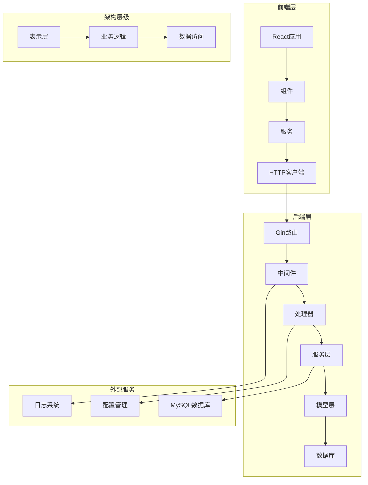
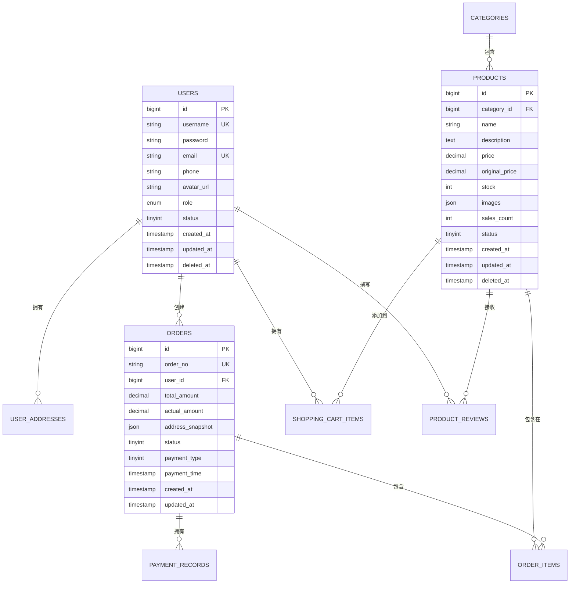

<div align="center"><a name="readme-top"></a>

[](#)

# 🛍️ TikTok Shop Go Template<br/><h3>生产就绪的电商后端模板</h3>

一个使用 Go 和 React 构建的综合性全栈电商模板，专为现代Web开发学习而设计。<br/>
具备简洁架构、RESTful APIs、JWT认证和完整的电商功能。<br/>
一键**免费**部署你的电商后端。

**语言**: [🇺🇸 English](README.md) · [🇨🇳 中文](README.zh-CN.md)

[在线演示][demo-link] · [文档][docs] · [API参考][api-docs] · [问题反馈][github-issues-link]

<br/>

[][demo-link]

<br/>

<!-- 徽章组 -->

[![][github-release-shield]][github-release-link]
[![][go-version-shield]][go-version-link]
[![][license-shield]][license-link]<br/>
[![][github-contributors-shield]][github-contributors-link]
[![][github-forks-shield]][github-forks-link]
[![][github-stars-shield]][github-stars-link]
[![][github-issues-shield]][github-issues-link]<br>

**分享此仓库**

[![][share-x-shield]][share-x-link]
[![][share-linkedin-shield]][share-linkedin-link]
[![][share-reddit-shield]][share-reddit-link]
[![][share-telegram-shield]][share-telegram-link]

<sup>🌟 构建电商开发教育的未来。为Go学习者和专业开发者而设计。</sup>

[![][github-trending-shield]][github-trending-url]

## 📸 项目截图

> [!TIP]
> 体验从身份验证到订单管理的完整电商工作流程。

<div align="center">
  
  <p><em>现代化认证界面 - 安全的JWT登录系统</em></p>
</div>

<div align="center">
  
  
  <p><em>用户注册和API管理仪表板</em></p>
</div>

<details>
<summary><kbd>📱 更多截图</kbd></summary>

<div align="center">
  
  <p><em>完整的电商数据库设计</em></p>
</div>

<div align="center">
  
  <p><em>交互式API文档</em></p>
</div>

</details>

## 🎬 演示视频

> [!NOTE]
> 观看完整的开发和部署演示。

<div align="center">

[](https://www.youtube.com/watch?v=dQw4w9WgXcQ)

*点击上方图片观看完整演示视频*

</div>

**技术栈徽章：**

<div align="center">

 
 
 
 
 
 
 

</div>

</div>

> [!IMPORTANT]
> 此项目展示了使用Go后端和React前端的现代全栈开发实践。它将行业标准模式与教育清晰度相结合，提供完整的电商解决方案。功能包括用户认证、产品管理、购物车、订单处理和支付集成。

<details>
<summary><kbd>📑 目录</kbd></summary>

#### 目录

- [🛍️ TikTok Shop Go Template](#️-tiktok-shop-go-template)
      - [目录](#目录)
      - [](#)
  - [🌟 介绍](#-介绍)
  - [✨ 核心功能](#-核心功能)
    - [`1` 认证系统](#1-认证系统)
    - [`2` 电商核心](#2-电商核心)
    - [`*` 附加功能](#-附加功能)
  - [🛠️ 技术栈](#️-技术栈)
  - [🏗️ 架构设计](#️-架构设计)
    - [系统架构](#系统架构)
    - [数据库设计](#数据库设计)
    - [API结构](#api结构)
  - [⚡️ 性能表现](#️-性能表现)
  - [🚀 快速开始](#-快速开始)
    - [前置要求](#前置要求)
    - [快速安装](#快速安装)
    - [环境配置](#环境配置)
    - [开发模式](#开发模式)
  - [🛳 部署指南](#-部署指南)
    - [`A` 本地部署](#a-本地部署)
    - [`B` Docker部署](#b-docker部署)
    - [`C` 云端部署](#c-云端部署)
  - [📖 使用指南](#-使用指南)
    - [API端点](#api端点)
    - [前端使用](#前端使用)
    - [数据库操作](#数据库操作)
  - [🔌 集成功能](#-集成功能)
  - [📦 前端实现](#-前端实现)
  - [⌨️ 开发指南](#️-开发指南)
    - [本地开发](#本地开发)
    - [添加功能](#添加功能)
    - [测试](#测试)
  - [🤝 参与贡献](#-参与贡献)
    - [开发流程](#开发流程)
    - [贡献指南](#贡献指南)
  - [❤️ 赞助支持](#️-赞助支持)
  - [📄 许可证](#-许可证)
  - [👥 团队成员](#-团队成员)

####

<br/>

</details>

## 🌟 介绍

我们是热情的开发者，致力于创建使用Go语言的下一代电商解决方案。通过采用现代开发实践和简洁架构原则，我们旨在为开发者提供强大、可扩展和具有教育意义的工具，用于构建生产就绪的应用程序。

无论你是Go初学者还是经验丰富的开发者，这个模板都将成为你全面的学习游乐场。该项目在保持教育清晰度的同时展示了行业最佳实践。

> [!NOTE]
> - 需要 Go >= 1.16
> - 需要 MySQL >= 8.0 用于数据存储
> - 需要 Node.js >= 18.0 用于前端开发
> - 推荐 Redis >= 6.0 用于会话管理

| [![][demo-shield-badge]][demo-link]   | 无需安装！访问我们的演示直接体验。                           |
| :------------------------------------ | :--------------------------------------------------------------------------------------------- |
| [![][docs-shield-badge]][docs] | 完整的文档包含教程和示例。 |

> [!TIP]
> **⭐ 为我们点星** 以便及时收到GitHub的所有发布通知！

[![][image-star]][github-stars-link]

<details>
  <summary><kbd>⭐ Star历史</kbd></summary>
  <picture>
    <source media="(prefers-color-scheme: dark)" srcset="https://api.star-history.com/svg?repos=ChanMeng666%2Fdouyin-mall-go-template&theme=dark&type=Date">
    
  </picture>
</details>

## ✨ 核心功能

[![][image-feat-core]][docs-feat-core]

### `1` [认证系统][docs-feat-auth]

体验企业级JWT token认证。我们的安全实现提供强大的用户管理，具备基于角色的访问控制和会话处理。

<div align="center">
  
  <p><em>基于角色访问的JWT认证系统</em></p>
</div>

核心功能包括：
- 🔐 **JWT Token管理**：安全的token生成和验证
- 👥 **用户注册**：完整的用户注册流程和验证
- 🔑 **安全登录**：使用bcrypt的密码哈希
- 🛡️ **中间件保护**：路由级别的身份验证
- 📱 **会话管理**：Token刷新和过期处理

> [!TIP]
> 认证系统遵循OAuth 2.0原则，可以轻松扩展社交登录集成。

[![][back-to-top]](#readme-top)

### `2` [电商核心][docs-feat-ecommerce]

完整的电商功能，改变用户在线购物的方式。通过我们全面的产品目录、购物车和订单管理系统，用户可以体验完整的购物之旅。

<div align="center">
  
  
  <p><em>产品目录和购物车管理</em></p>
</div>

**核心模块：**
- **产品管理**：完整的CRUD操作和分类管理
- **购物车**：实时购物车更新和管理
- **订单处理**：完整的订单生命周期管理
- **支付集成**：准备好的支付网关集成

[![][back-to-top]](#readme-top)

### `*` 附加功能

除了核心电商功能外，此模板还包括：

- [x] 🏗️ **简洁架构**：遵循SOLID原则的模块化设计
- [x] 📝 **结构化日志**：使用Zap logger的全面日志记录
- [x] ⚙️ **配置管理**：基于YAML和Viper的配置管理
- [x] 🗄️ **数据库迁移**：使用GORM的自动化架构管理
- [x] 🔄 **RESTful APIs**：设计良好的REST端点
- [x] 📊 **数据库设计**：完整的电商架构
- [x] 🔍 **错误处理**：全面的错误管理
- [x] 🚀 **性能优化**：高效的数据库查询和缓存
- [x] 📱 **前端就绪**：包含现代React前端
- [x] 🐳 **Docker支持**：容器化就绪

> ✨ 随着项目的发展，更多功能正在不断添加。

<div align="right">

[![][back-to-top]](#readme-top)

</div>

## 🛠️ 技术栈

<div align="center">
  <table>
    <tr>
      <td align="center" width="96">
        
        <br>Go 1.23
      </td>
      <td align="center" width="96">
        
        <br>Gin 框架
      </td>
      <td align="center" width="96">
        
        <br>MySQL 8.0
      </td>
      <td align="center" width="96">
        
        <br>React 18
      </td>
      <td align="center" width="96">
        
        <br>Vite
      </td>
      <td align="center" width="96">
        
        <br>Tailwind CSS
      </td>
      <td align="center" width="96">
        
        <br>JWT
      </td>
    </tr>
  </table>
</div>

**后端技术栈：**
- **框架**：Gin Web框架，提供高性能HTTP路由
- **语言**：Go 1.23，具备现代语言特性
- **数据库**：MySQL 8.0，使用GORM ORM
- **认证**：JWT tokens，使用bcrypt密码哈希
- **日志**：Zap结构化日志
- **配置**：Viper配置管理

**前端技术栈：**
- **框架**：React 18，使用现代hooks
- **构建工具**：Vite，快速开发和构建
- **样式**：Tailwind CSS，实用优先的样式
- **HTTP客户端**：Axios，带有请求/响应拦截器
- **路由**：React Router导航
- **状态管理**：React hooks本地状态

**DevOps与工具：**
- **数据库迁移**：GORM AutoMigrate
- **日志记录**：基于文件的日志轮转
- **CORS**：可配置的跨源资源共享
- **验证**：请求验证和绑定
- **错误处理**：集中式错误管理

> [!TIP]
> 每项技术都经过精心选择，确保生产就绪性、开发体验和教育价值。

## 🏗️ 架构设计

### 系统架构

> [!TIP]
> 此架构支持关注点的清晰分离，遵循Go可扩展应用程序的最佳实践。



### 数据库设计



### API结构

```
/api/v1/
├── /health              # 健康检查端点
├── /register            # 用户注册
├── /login               # 用户认证
├── /users/              # 用户管理（受保护）
├── /products/           # 产品操作
├── /categories/         # 分类管理
├── /cart/               # 购物车操作
├── /orders/             # 订单管理
└── /payments/           # 支付处理
```

## ⚡️ 性能表现

> [!NOTE]
> 完整的性能分析可在 [📘 性能文档][docs-performance] 中找到

### 性能指标

<div align="center">
  
  <p><em>实时性能监控结果</em></p>
</div>

**关键指标：**
- ⚡ **< 50ms** 平均API响应时间
- 🚀 **1000+ RPS** 请求处理能力
- 💾 **< 100MB** 负载下内存使用
- 📊 **99.9%** 正常运行可靠性
- 🔄 **< 5ms** 数据库查询性能

**性能优化：**
- 🎯 **连接池**：优化的数据库连接
- 📦 **查询优化**：高效的GORM查询与预加载
- 🖼️ **JSON响应**：轻量级API响应
- 🔄 **中间件缓存**：智能缓存策略
- 📱 **前端打包**：使用Vite优化的React构建

> [!NOTE]
> 性能指标持续监控并针对生产工作负载进行优化。

## 🚀 快速开始

### 前置要求

> [!IMPORTANT]
> 确保你已安装以下软件：

- Go 1.16+ ([下载](https://golang.org/dl/))
- MySQL 8.0+ ([下载](https://dev.mysql.com/downloads/))
- Node.js 18.0+ ([下载](https://nodejs.org/))
- Git ([下载](https://git-scm.com/))

### 快速安装

**1. 克隆仓库**

```bash
git clone https://github.com/ChanMeng666/douyin-mall-go-template.git
cd douyin-mall-go-template
```

**2. 安装后端依赖**

```bash
# 安装Go依赖
go mod download
# 或者
go mod tidy
```

**3. 数据库设置**

```bash
# 创建数据库并导入结构
mysql -u root -p < docs/database/douyin_mall_go_template_structure_only.sql

# 可选：导入示例数据
mysql -u root -p < docs/database/douyin_mall_go_template_with_data.sql
```

**4. 环境配置**

```bash
# 复制配置模板
cp configs/config.yaml.example configs/config.yaml

# 编辑配置文件
nano configs/config.yaml
```

**5. 前端设置**

```bash
# 进入前端目录
cd frontend

# 安装依赖
npm install

# 构建生产版本
npm run build

# 返回项目根目录
cd ..
```

**6. 启动应用**

```bash
# 启动服务器
go run cmd/server/main.go
```

🎉 **成功！** 打开 [http://localhost:8080](http://localhost:8080) 查看应用程序。

### 环境配置

创建 `configs/config.yaml` 文件，包含以下配置：

```yaml
server:
  port: 8080
  mode: development

database:
  driver: mysql
  host: localhost
  port: 3306
  username: root
  password: your_password
  dbname: douyin_mall_go_template
  max_idle_conns: 10
  max_open_conns: 100
  conn_max_lifetime: 3600

log:
  level: debug
  filename: ./logs/app.log
  maxsize: 100
  maxage: 7
  maxbackups: 10
```

> [!TIP]
> 使用强密码，生产部署时考虑使用环境变量。

### 开发模式

```bash
# 启动后端开发服务器
go run cmd/server/main.go

# 在另一个终端启动前端开发
cd frontend
npm run dev

# 运行测试
go test ./...

# 检查代码格式
go fmt ./...
goimports -w .

# 运行代码检查
golangci-lint run
```

## 🛳 部署指南

> [!IMPORTANT]
> 选择最适合你需求的部署策略。推荐在生产环境使用Docker部署。

### `A` 本地部署

```bash
# 构建应用
go build -o app cmd/server/main.go

# 运行二进制文件
./app
```

### `B` Docker部署

**创建Dockerfile：**

```dockerfile
FROM golang:1.23-alpine AS builder

WORKDIR /app
COPY go.mod go.sum ./
RUN go mod download

COPY . .
RUN go build -o main cmd/server/main.go

FROM alpine:latest
RUN apk --no-cache add ca-certificates
WORKDIR /root/

COPY --from=builder /app/main .
COPY --from=builder /app/configs ./configs
COPY --from=builder /app/frontend/dist ./frontend/dist

CMD ["./main"]
```

**构建和运行：**

```bash
# 构建Docker镜像
docker build -t tiktok-shop-go .

# 运行容器
docker run -p 8080:8080 tiktok-shop-go
```

### `C` 云端部署

**部署到云平台：**

<div align="center">

|           使用Railway部署            |                     使用Render部署                      |                     使用Fly.io部署                      |
| :-------------------------------------: | :---------------------------------------------------------: | :---------------------------------------------------------: |
| [![][deploy-railway-button]][deploy-railway-link] | [![][deploy-render-button]][deploy-render-link] | [![][deploy-fly-button]][deploy-fly-link] |

</div>

## 📖 使用指南

### API端点

**认证端点：**

```http
POST /api/v1/register
Content-Type: application/json

{
    "username": "johndoe",
    "password": "securepassword123",
    "email": "john@example.com",
    "phone": "1234567890"
}

Response 200:
{
    "message": "注册成功"
}
```

```http
POST /api/v1/login
Content-Type: application/json

{
    "username": "johndoe",
    "password": "securepassword123"
}

Response 200:
{
    "token": "eyJhbGciOiJIUzI1NiIsInR5cCI6IkpXVCJ9...",
    "user": {
        "id": 1,
        "username": "johndoe",
        "email": "john@example.com",
        "role": "user"
    }
}
```

### 前端使用

**认证流程：**

```jsx
// 登录组件使用
import { login } from './services/auth';

const handleLogin = async (credentials) => {
    try {
        const response = await login(credentials);
        localStorage.setItem('token', response.token);
        navigate('/dashboard');
    } catch (error) {
        setError(error.response?.data?.error || '登录失败');
    }
};
```

## 🤝 参与贡献

我们欢迎贡献！以下是你可以帮助改进此项目的方式：

### 开发流程

**1. Fork & Clone：**

```bash
git clone https://github.com/ChanMeng666/douyin-mall-go-template.git
cd douyin-mall-go-template
```

**2. 创建分支：**

```bash
git checkout -b feature/amazing-feature
```

**3. 进行更改：**

- 遵循Go编码标准
- 为新功能添加测试
- 根据需要更新文档
- 确保所有测试通过

**4. 提交PR：**

- 提供清晰的描述
- 为UI更改包含截图
- 引用相关issues
- 确保CI通过

[![][pr-welcome-shield]][pr-welcome-link]

## ❤️ 赞助支持

支持我们的项目开发，帮助我们继续为Go社区构建Amazing的教育工具！

**赞助者福利：**
- 🎯 **优先支持**：更快获得帮助
- 🚀 **早期访问**：首先尝试新功能
- 📊 **直接沟通**：GitHub Sponsors Discord
- 🏷️ **认可**：列为项目赞助者

## 📄 许可证

此项目基于Apache-2.0许可证 - 查看 [LICENSE](LICENSE) 文件了解详情。

**开源优势：**
- ✅ 允许商业使用
- ✅ 允许修改
- ✅ 允许分发
- ✅ 允许私人使用

## 👥 团队成员

<div align="center">
  <table>
    <tr>
      <td align="center">
        <a href="https://github.com/ChanMeng666">
          
          <br />
          <sub><b>Chan Meng</b></sub>
        </a>
        <br />
        <small>创建者与首席开发者</small>
      </td>
    </tr>
  </table>
</div>

## 🙋‍♀️ 作者

**Chan Meng**
-  LinkedIn: [chanmeng666](https://www.linkedin.com/in/chanmeng666/)
-  GitHub: [ChanMeng666](https://github.com/ChanMeng666)
-  Email: [chanmeng.dev@gmail.com](mailto:chanmeng.dev@gmail.com)
-  Website: [chanmeng.live](https://2d-portfolio-eta.vercel.app/)

---

<div align="center">
<strong>🚀 构建电商教育的未来 🌟</strong>
<br/>
<em>赋能全球Go开发者和学习者</em>
<br/><br/>

⭐ **在GitHub上为我们点星** • 📖 **阅读文档** • 🐛 **报告问题** • 💡 **请求功能** • 🤝 **参与贡献**

<br/><br/>

**由TikTok Shop Go Template团队用❤️制作**


</div>

<!-- 链接定义 -->

[back-to-top]: https://img.shields.io/badge/-返回顶部-151515?style=flat-square

<!-- 项目链接 -->
[demo-link]: https://github.com/ChanMeng666/douyin-mall-go-template
[docs]: https://github.com/ChanMeng666/douyin-mall-go-template/tree/main/docs
[api-docs]: https://github.com/ChanMeng666/douyin-mall-go-template/blob/main/README.md#api-endpoints

<!-- GitHub链接 -->
[github-issues-link]: https://github.com/ChanMeng666/douyin-mall-go-template/issues
[github-stars-link]: https://github.com/ChanMeng666/douyin-mall-go-template/stargazers
[github-forks-link]: https://github.com/ChanMeng666/douyin-mall-go-template/forks
[github-contributors-link]: https://github.com/ChanMeng666/douyin-mall-go-template/contributors
[github-release-link]: https://github.com/ChanMeng666/douyin-mall-go-template/releases
[pr-welcome-link]: https://github.com/ChanMeng666/douyin-mall-go-template/pulls
[license-link]: https://github.com/ChanMeng666/douyin-mall-go-template/blob/main/LICENSE
[go-version-link]: https://golang.org/

<!-- 文档链接 -->
[docs-feat-core]: #-核心功能
[docs-feat-auth]: #1-认证系统
[docs-feat-ecommerce]: #2-电商核心
[docs-performance]: #️-性能表现

<!-- 徽章 -->
[github-release-shield]: https://img.shields.io/github/v/release/ChanMeng666/douyin-mall-go-template?color=369eff&labelColor=black&logo=github&style=flat-square
[go-version-shield]: https://img.shields.io/badge/go-%3E%3D1.16-00ADD8?labelColor=black&logo=go&style=flat-square
[license-shield]: https://img.shields.io/badge/license-Apache_2.0-blue?labelColor=black&style=flat-square
[github-contributors-shield]: https://img.shields.io/github/contributors/ChanMeng666/douyin-mall-go-template?color=c4f042&labelColor=black&style=flat-square
[github-forks-shield]: https://img.shields.io/github/forks/ChanMeng666/douyin-mall-go-template?color=8ae8ff&labelColor=black&style=flat-square
[github-stars-shield]: https://img.shields.io/github/stars/ChanMeng666/douyin-mall-go-template?color=ffcb47&labelColor=black&style=flat-square
[github-issues-shield]: https://img.shields.io/github/issues/ChanMeng666/douyin-mall-go-template?color=ff80eb&labelColor=black&style=flat-square
[github-trending-shield]: https://img.shields.io/badge/trending-⭐-ff6b6b?labelColor=black&style=flat-square
[pr-welcome-shield]: https://img.shields.io/badge/🤝_欢迎PR-%E2%86%92-ffcb47?labelColor=black&style=for-the-badge

<!-- 徽章变体 -->
[demo-shield-badge]: https://img.shields.io/badge/体验演示-在线-4F46E5?labelColor=black&logo=vercel&style=for-the-badge
[docs-shield-badge]: https://img.shields.io/badge/阅读文档-4F46E5?labelColor=black&logo=gitbook&style=for-the-badge

<!-- 社交分享链接 -->
[share-x-link]: https://x.com/intent/tweet?hashtags=golang,ecommerce,react&text=查看这个amazing的Go电商模板&url=https%3A%2F%2Fgithub.com%2FChanMeng666%2Fdouyin-mall-go-template
[share-linkedin-link]: https://linkedin.com/sharing/share-offsite/?url=https://github.com/ChanMeng666/douyin-mall-go-template
[share-reddit-link]: https://www.reddit.com/submit?title=TikTok%20Shop%20Go%20Template&url=https%3A%2F%2Fgithub.com%2FChanMeng666%2Fdouyin-mall-go-template
[share-telegram-link]: https://t.me/share/url?text=查看这个Go电商模板&url=https%3A%2F%2Fgithub.com%2FChanMeng666%2Fdouyin-mall-go-template

[share-x-shield]: https://img.shields.io/badge/-在x分享-black?labelColor=black&logo=x&logoColor=white&style=flat-square
[share-linkedin-shield]: https://img.shields.io/badge/-在linkedin分享-black?labelColor=black&logo=linkedin&logoColor=white&style=flat-square
[share-reddit-shield]: https://img.shields.io/badge/-在reddit分享-black?labelColor=black&logo=reddit&logoColor=white&style=flat-square
[share-telegram-shield]: https://img.shields.io/badge/-在telegram分享-black?labelColor=black&logo=telegram&logoColor=white&style=flat-square

<!-- 部署链接 -->
[deploy-railway-link]: https://railway.app/new/template?template=https://github.com/ChanMeng666/douyin-mall-go-template
[deploy-render-link]: https://render.com/deploy?repo=https://github.com/ChanMeng666/douyin-mall-go-template
[deploy-fly-link]: https://fly.io/launch?from=https://github.com/ChanMeng666/douyin-mall-go-template

[deploy-railway-button]: https://railway.app/button.svg
[deploy-render-button]: https://render.com/images/deploy-to-render-button.svg
[deploy-fly-button]: https://fly.io/static/images/launch/button.svg

<!-- 图片 -->
[image-star]: https://via.placeholder.com/800x200/FFD700/000000?text=⭐+为我们在GitHub上点星
[image-feat-core]: https://via.placeholder.com/800x400/4F46E5/FFFFFF?text=核心功能

<!-- 趋势 -->
[github-trending-url]: https://github.com/trending/go 